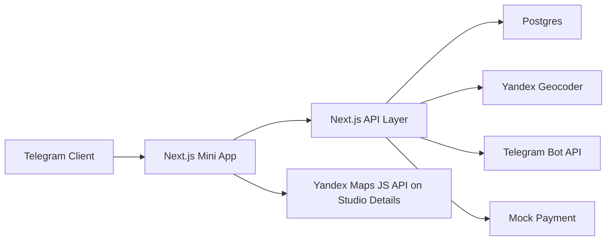

# Architecture Draft

## Рекомендуемая схема MVP

## Модули

- `auth`: проверка Telegram initData, создание/обновление пользователя.
- `studios`: каталог студий звукозаписи, комнаты, услуги, оборудование, фото.
- `search`: фильтры, сортировка, поиск по метро/району/цене/оборудованию.
- `map`: клиентская интеграция Yandex Maps JS API на экране студии.
- `availability`: слоты студий, занятость, блокировки.
- `bookings`: создание, отмена, статусы брони.
- `payments`: mock-оплата на MVP, интерфейс под будущую реальную платежку.
- `studio-dashboard`: кабинет студии.
- `notifications`: сообщения через Telegram Bot API.

## Статусы брони

- `draft`
- `pending_payment`
- `paid_mock`
- `confirmed`
- `cancelled_by_user`
- `cancelled_by_studio`
- `expired`

## Будущий статус

- `pending_studio_confirmation` - добавить позже для режима, где студия подтверждает бронь вручную.

## Критичные правила

- Бронь слота создается транзакционно.
- Один слот нельзя забронировать дважды.
- В MVP бронь после mock-оплаты становится `confirmed`.
- Telegram initData валидируется на backend.
- Публичный Yandex Maps key должен быть ограничен доменами после деплоя.
- Payment mock должен быть отдельным интерфейсом, чтобы позже заменить его на реальную платежку.

